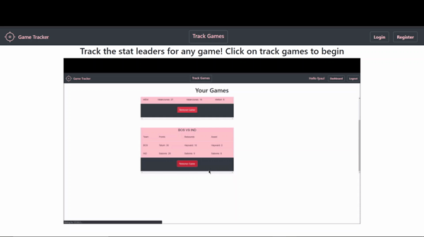

# NBA Game Tracker Project

#### Purpose:
A site where you can see all the nba games and find out who has the highest points, rebounds, assist in real time. 

#### Journey:
The Django framework is very powerful because of how it easy it was to create user models and authenticate users, creating an api and serving views based on the url request. Overall, I liked working with it.

#### Issues:
I tried my best to deploy the app to heroku but had difficulty because 
1. My static files were not always being served for some reason.
2. I could not figure out how to change 127.0.0.1:8000 to point to the domain of my application.

## Demos

### User authentication

### Game Tracking
